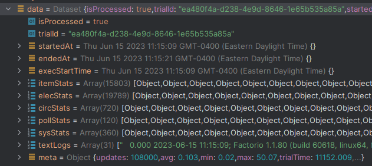

# factorio-analytics

A package that gives you in-depth details and statistics about your blueprint's in-game functionality

This library utilizes the factorio executable on your local machine, so a copy of Factorio is also required to use this package. 

### Recommended Setup

- Linux (Though, Windows *should* work fine as well)
- A separate install of Factorio, downloaded from their website.
  - This can help keep mods and settings separate between your gaming install and your code install

## Getting Started

### Usage
This package is intended to be used with NodeJS, for server use only. It is meant to be used as an NPM module, but also has various CLI options as well.

### Install via NPM

```
$ npm install factorio-analytics
```

### Starting the Factory

Set env variables FACTORIO_INSTALL and FACTORIO_DATA as explained below for easier usage.
```ts
await Factory.initialize({
    // INSTALL DIR of factorio - inside this folder should be others like 'bin' and 'data'
    installDir: process.env.FACTORIO_INSTALL,

    // DATA DIR of factorio - inside this folder should be others like 'mods' and 'scenarios'. This is the user information about factorio
    // NOTE - If you have installed Factorio to a custom location yourself, this will be the same as the installDir
    dataDir: process.env.FACTORIO_DATA,

    // The name to use for the scenario. This will be the name of the folder inside the 'scenarios' folder
    scenarioName: 'factorio-analytics',

    // Whether or not we want to hide console logs to the user. Will still be written to file factory.log no matter what
    hideConsoleLogs: true
});
```

### Set up a Blueprint Trial

The first step is to define what you want to test - you need to provide at minimum the Blueprint string, length of the trial, and at least 1 Interval set depending on what data you would like to export about your factory.

_This assumes a file 'filename.bp' exists with your blueprint string inside_

```ts
let bp = fs.readFileSync('filename.bp', 'utf8');

let t = new Trial({
  // Either a reference to the blueprint object, or a blueprint string itself to run
  bp,

  // how long (ticks) the trial will run for. Remember, factorio is locked at 60 ticks per second
  length: 108000,

  // how many ticks between item data polls (Items/fluids produced and consumed across the factory)
  itemInterval: 300,

  // how many ticks between elec data polls (The power usage and production of the factory, per network)
  elecInterval: 60,

  // how many ticks between circ data polls (Each circuit network, and the signals on it)
  circInterval: 300,

  // how many ticks between Pollution data polls (The pollution of the factory, total)
  pollInterval: 900,

  // how many ticks of performance info should be grouped together (Perf info is recorded every tick by default)
  sysInterval: 300,

  // how many logistic bots to start roboports with. If left as is, none will be placed
  initialBots: 300,

  // If true, the trial does no processing after the fact. Data is left raw, no files are moved. Remember to clean up!
  raw: false
});
```

### Run a Blueprint Trial
If this throws errors, there is likely something incorrect with your factorio install / paths provided to the install
```ts
let t = new Trial({/*see above*/});

// Have the factory run your blueprint trial - depending on your PC and the settings for the Trial, this can take some time.
await Factory.runTrial(t);

// Write out to a file to explore the data, or do whatever you want to otherwise utilize this information.
// Results are stored in the 'Data' object, see below for more details
fs.writeFileSync('output.json', t.data);

```
### Analyze and Use Data
View all output data types [here](dist/src/Dataset.d.ts)
```ts
// After running the trial, data is available...
let d: Dataset = trial.data;

// processed data aligned with tickrate is available in respective variables... 
// each below is an array potentially thousands long, containing values over time (in ticks)
// See types at 
let export = {
    itemStats: d.itemStats, // IGameFlowTick
    elecStats: d.elecStats, // IGameElectricTick
    circStats: d.circStats, // IGameCircuitTick
    pollStats: d.pollStats, // IGamePollutionTick
    sysStats: d.sysStats,   // ISystemTick
}

// If you choose to export raw files (NOT process data, keeping it raw) then the files variable will be set, 
// containing the absolute filepath to the raw data
console.log(d.files);

// Lastly, you can use some helper functions on the Dataset to help provide fast information, such as...
// compare to if we do it all-in-one
let ratioIronToCoal = data
        .get({category: 'item', label: 'iron-plate', direction: 'prod'})
        .per({category: 'item', label: 'coal', direction: 'cons'});

// or...
let inserterPowerRatio = data
        .get({category: 'electric', label: 'inserter', direction: 'cons'})
        .per({category: 'electric', label: 'all', direction: 'cons'});

// NOTE - you MUST be recording the needed data with the trial for certain functionality to work. For example, you cannot
// calculate the 'inserterPowerRatio' above without recording elecStats (make sure elecInterval is defined)
```

### The 'Dataset' that is returned from running a trial can look something like this...



## Advanced 

The following information is useful if you're attempting to...
- Add mods to the benchmarking process
- Change world settings (such as the 500x500 limit)
- Want to update your scenario to a specific version of Factorio
  - If the scenario version is different than the executable, then there is an added delay due to a 'migration' process
  - Compiling your own scenario using your install would solve this

### Compiling your own benchmark scenario

To compile your own scenario file...
1. Copy factory/scenario-source folder to your factorio/scenarios location (so that factorio sees it as a scenario)
2. Run ```factorio -m scenario-source```
3. In your 'saves' location, there should now be a file called 'scenario-source.zip'. Copy everything inside of this zip
to factorio-analytics/factory/scenario, overwriting all files.

From this, your custom scenario should now be used in any benchmarks. If you managed to get mods working and through the 'conversion' process above,
then it SHOULD be able to function without issues. Note that making a custom scenario is only 1 part of getting mods working.

**NOTE** - in some mods, the scenario has issues loading or converting due to requiring a 'player' character in-game, which we do not have.
I have found that simply copying the level.dat files from the 'vanilla' scenario to the 'modded' scenario can get it to at least run, but it likely
misses important startup steps required for mods to function. I have tested this with basic Krastorio blueprints and bases without any real issues,
but can't guarantee anything will work for real

### Adding mods

You might have noticed that there is a folder here factory/mods. If you copy your entire 'mods' directory for Factorio into this folder,
those mods and their settings will be loaded for the benchmark. 

**NOTE** - it is HIGHLY RECOMMENDED that you compile a custom benchmark scenario when doing this as well. Otherwise, trials take MUCH longer to run due to
the 'migration' process, which may not even be successful depending on the type/complexity of the mods in question.

**NOTE 2** - Any mods that manipulate / use surfaces for their features (such as warehouses) will not function as intended - I am honestly
not even sure if the blueprint will even place it correctly.


## CLI Usage

Want to use all this functionality in a different application, or just otherwise access it via CLI? There are 2 premade scripts that you can use

#### buildTrial

This command will 'build' a given trial, which essentially sets it up to be run. From here, you can then launch the Factorio
executable yourself and view the trial live!

_(note, this is mostly for debugging)_

```plantuml
node /path/to/package/factorio-analytics/dist/scripts/buildTrial.js 
--bpFile /path/to/package/factorio-analytics/factory/examples/smallbasev2.txt
--length 108000 
--item 300
--elec 60
--circ 300
--pollution 900
--sys 300
--raw false
```


#### runTrial

This command will first 'build' a trial with your parameters, then command the Factory to 'run' the trial and output data to a specific file location.
If no file location is specified, it will be written to the current directory instead with an ID filename.

```plantuml
node /path/to/package/factorio-analytics/dist/scripts/runTrial.js 
--bpFile /path/to/package/factorio-analytics/factory/examples/smallbasev2.txt
--length 108000 
--item 300
--elec 60
--circ 300
--pollution 900
--sys 300
--raw false
--file /path/to/output/output.json
```
